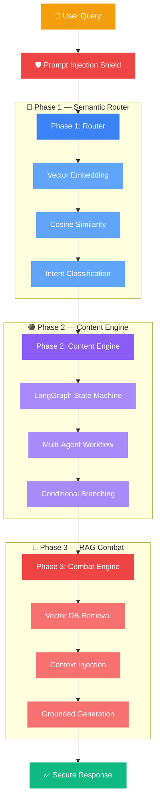

<div align="center">

<!-- Animated Header -->


<!-- Typing SVG -->
<a href="https://git.io/typing-svg"></a>

<br/>

<!-- Badges -->


</div>

---

<div align="center">
<h2>🎯 What It Does</h2>
<p><i>An intelligent AI backend that routes queries through semantic vectors, orchestrates multi-step reasoning, and retrieves context-aware responses — all secured against prompt injection attacks.</i></p>
</div>

---

<div align="center">
<h2>🏗️ Three-Phase Architecture</h2>
</div>



---

<div align="center">
<h2>✨ Key Features</h2>
</div>

<table>
<tr>
<td align="center" width="25%">
<br/><br/>
Semantic similarity-based query routing to specialized agent nodes
</td>
<td align="center" width="25%">
<br/><br/>
Stateful multi-agent workflows with conditional branching
</td>
<td align="center" width="25%">
<br/><br/>
Vector DB retrieval for context-grounded generation
</td>
<td align="center" width="25%">
<br/><br/>
Multi-layered prompt injection protection
</td>
</tr>
</table>

---

<div align="center">
<h2>📁 Project Structure</h2>
</div>

```
grid07-cognitive-engine/
├── 🚀 main.py                    # Entry point
├── ⚙️ config.py                  # Configuration
├── 🎭 personas.py                # Agent persona definitions
├── 🔵 phase1_router.py           # Semantic vector routing
├── 🟣 phase2_content_engine.py   # Content generation engine
├── 🔴 phase3_combat_engine.py    # RAG combat engine
├── 📋 requirements.txt
├── 🧪 tests/                     # Test suite
├── 🔧 tools/                     # Utility tools
└── 📦 utils/                     # Helper functions
```

---

<div align="center">
<h2>🚀 Quick Start</h2>
</div>

```bash
git clone https://github.com/udayraj1238/grid07-cognitive-engine.git
cd grid07-cognitive-engine
pip install -r requirements.txt
cp .env.example .env  # Add your API keys
python main.py
```

---

<div align="center">

<h2>🤝 Contact</h2>
<a href="https://www.linkedin.com/in/uday6002/"></a>
<a href="https://udayraj1238.vercel.app"></a>
<a href="mailto:rajuday6002@gmail.com"></a>

</div>


